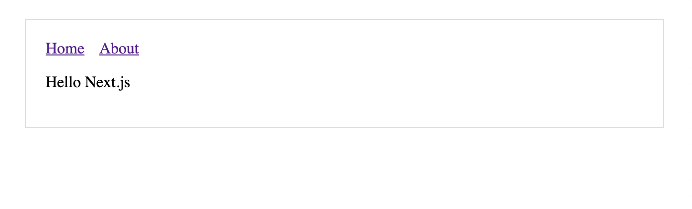

## 공통 컴포넌트

Header처럼 페이지 전반에 공유되는 컴포넌트를 분리하여 사용. 스타일을 지정하고 페이지 레이아웃 및 기타 원하는 모든 작업에 해당 컴포넌트들을 사용할 수 있다.

### [Header 컴포넌트](https://github.com/fldfls/Front/blob/main/Next/Training/practice/components/Header.js)


### [Layout 컴포넌트](https://github.com/fldfls/Front/blob/main/Next/Training/practice/components/Layout.js)



Layout component에서 {props.children}을 삭제함 Layout은 하위에 둔 내용들을 렌더링하지 못하면서 표시되는 페이지의 내용이 사라진다.

아래와 같은 방법으로 생성할 수도 있다.

```JS
import withLayout from '../lib/layout'

const Page = () => (
    <p> this is about page</p>
)

export default withLayout(Page)
```

```JS
const Page = () => (
    <p>this is about page</p>
)

export default () => (<Layout page={Page}/>)
```

```JS
const content = (<p>this is about page</p>)
export default () => (<Layout content={content}/>)
```
